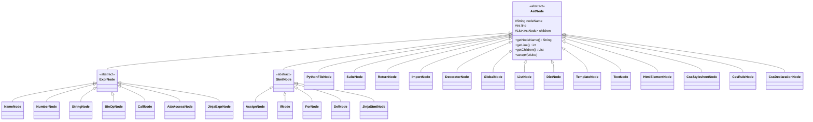
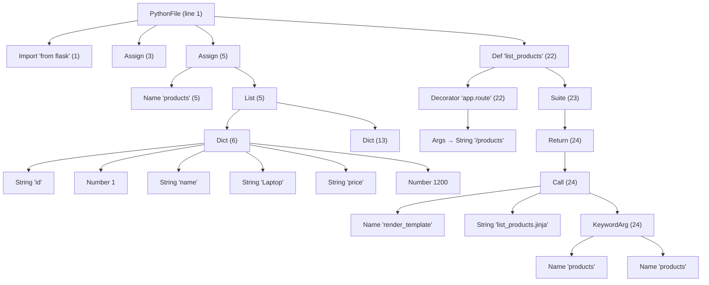
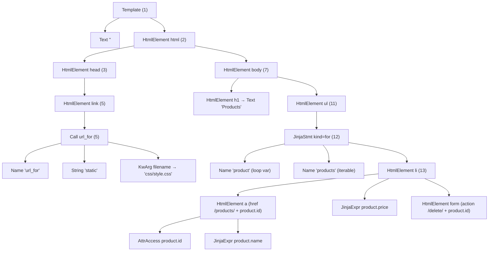
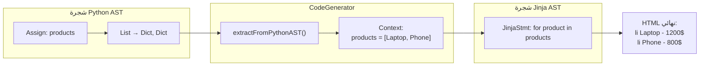

# مخطط بنية الـ AST — مشروع المترجمات

هذا المستند يوضّح بنية الأشجار المجردة (Abstract Syntax Trees) في المشروع:
1. **مخطط بنية العقد (OOP)** — الوراثة وتعدد الأشكال.
2. **شجرة Python AST** — مثال من `app.py`.
3. **شجرة Jinja AST** — مثال من `list_products.jinja`.
4. **تمرير البيانات** من شجرة Python إلى شجرة Jinja (مرحلة التوليد).

> المخططات بصيغة Mermaid — تظهر رسوماً تلقائياً في GitHub و VS Code. توجد نسخة نصية (ASCII) أسفل كل مخطط.

---

## 1) مخطط بنية العقد (OOP: Inheritance + Polymorphism)

كل العقد ترث من `AstNode` المجردة التي تخزّن **اسم العقدة** و**رقم السطر** وقائمة **الأبناء**، وتفرض تابع `accept()` (تعدد الأشكال عبر نمط Visitor).



**ASCII:**
```
AstNode (abstract)  ── nodeName, line, children[], accept()
├── ExprNode (abstract)   ← تعابير
│     ├── NameNode, NumberNode, StringNode
│     ├── BinOpNode, CallNode, AttrAccessNode
│     └── JinjaExprNode                 ({{ ... }})
├── StmtNode (abstract)   ← جُمَل
│     ├── AssignNode, IfNode, ForNode, DefNode
│     └── JinjaStmtNode                 ( / )
└── عقد أخرى: PythonFileNode, SuiteNode, ReturnNode, ImportNode,
    DecoratorNode, GlobalNode, ListNode, DictNode,
    TemplateNode, TextNode, HtmlElementNode,
    CssStylesheetNode, CssRuleNode, CssDeclarationNode
```

---

## 2) شجرة Python AST (مثال من `app.py`)

تمثيل لإسناد قائمة `products` ودالة `list_products` (المصدر الكامل في `compiler_output/ast_python.json`).



**ASCII:**
```
PythonFile (1)
├── Import "from flask" (1)
├── Assign (3)                         # app = Flask(...)
├── Assign (5)                         # products = [ ... ]
│   ├── Name "products" (5)
│   └── List (5)
│       ├── Dict (6)                   # {id:1, name:"Laptop", price:1200, ...}
│       │   ├── String "id"   / Number 1
│       │   ├── String "name" / String "Laptop"
│       │   └── String "price"/ Number 1200
│       └── Dict (13)                  # {id:2, name:"Phone", ...}
└── Def "list_products" (22)
    ├── Decorator "app.route" (22)
    │   └── Args → String "/products"
    └── Suite (23)
        └── Return (24)
            └── Call (24)              # render_template("list_products.jinja", products=products)
                ├── Name "render_template"
                ├── String "list_products.jinja"
                └── KeywordArg (24)
                    ├── Name "products"   (المفتاح)
                    └── Name "products"   (القيمة)
```

---

## 3) شجرة Jinja AST (مثال من `list_products.jinja`)

(المصدر الكامل في `compiler_output/ast_jinja.json`.)



**ASCII:**
```
Template (1)
├── Text "<!DOCTYPE html>"
└── HtmlElement <html> (2)
    ├── HtmlElement <head> (3)
    │   └── HtmlElement <link> (5)      attrs=[href="{{...}}"]
    │       └── Call url_for → 'static', filename='css/style.css'
    └── HtmlElement <body> (7)
        ├── HtmlElement <h1> → Text "Products"
        └── HtmlElement <ul> (11)
            └── JinjaStmt kind=for (12)         # 
                ├── Name "product"   (متغير الحلقة)
                ├── Name "products"  (المُكرَّر عليه)
                └── HtmlElement <li> (13)
                    ├── HtmlElement <a> → AttrAccess product.id + {{ product.name }}
                    ├── JinjaExpr {{ product.price }}
                    └── HtmlElement <form> → /delete/{{ product.id }}
```

---

## 4) تمرير البيانات: من شجرة Python ← إلى ← شجرة Jinja

في مرحلة التوليد (`CodeGenerator`)، يُستخرج المتغير `products` من **شجرة Python**، ثم يُحقن في **شجرة Jinja** لتوليد HTML نهائي:



**الفكرة باختصار:**
```
products (شجرة Python)  ──extract──►  [ {Laptop,1200}, {Phone,800} ]
                                              │  (الـ Context)
  ◄──inject──────┘
        │
        ▼
   <li>Laptop - 1200$</li>
   <li>Phone - 800$</li>
```

> هذا يحقق متطلب المشروع: «التابع المولّد يمرّر البيانات من مصفوفة البيانات في كود Python إلى الشجرة الثانية (Jinja)».
